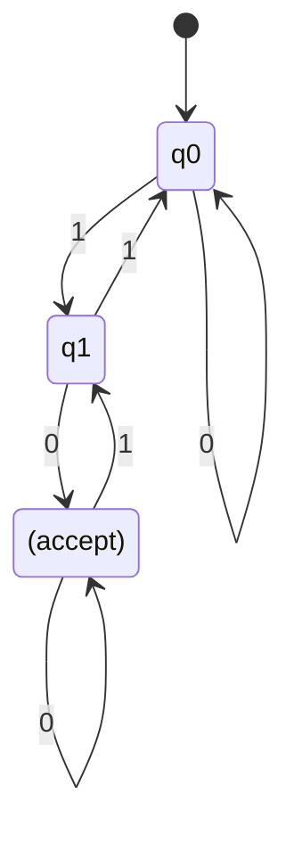
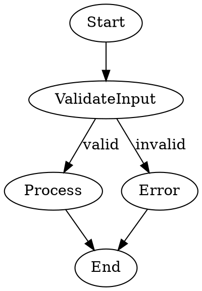

# Accurate Diagram Generation

## Intent

Generate reliable, machine-readable diagram specs (Mermaid or Graphviz/DOT) from user requests. The spec renders natively on ChatGPT and Claude canvases. For Perplexity, use the MCP DiagramGenerator tool for server-side SVG rendering.

## Core Rules

- **Output ONLY the spec** in a fenced code block: ```mermaid``` or ```dot```.
- **No prose, no explanation, no extra sections.** Only the code block.
- **Be deterministic:** avoid invented nodes, extra states, or speculative behavior.
- **MCP will validate** syntax + domain rules (determinism, reachability, etc.) before rendering.

## Platform-Specific Rendering

### ChatGPT
- Fenced ```mermaid code blocks render **natively in the canvas** — just include the block in your response.
- DOT format: pass to `DiagramGenerator` tool for server-side SVG.

### Claude
- Fenced ```mermaid code blocks render **natively in artifacts/canvas** — include the block directly.
- DOT format: pass to `DiagramGenerator` tool for server-side SVG.

### Perplexity
- Perplexity does **NOT** natively render Mermaid or DOT in responses.
- **ALWAYS** pass the spec to the `DiagramGenerator` MCP tool to render SVG server-side.
- Include the resulting SVG in your response for the user.
- Alternatively, if Perplexity's sandbox environment supports it, use the sandbox to execute Mermaid/Graphviz rendering and return the image.

## Prompt Template: Mermaid (DFA/FSM)

**System prompt:**
```
You are a deterministic diagram generator. 
Output ONLY a Mermaid state diagram code block.
Do not add prose, explanation, or anything outside the code block.
```

**User query (example):**
```
Generate a deterministic finite automaton (DFA) that recognizes binary strings over {0,1} ending in "01".
Use states q0, q1, q2 (no more).
Mark the start state with [*] --> q0.
Mark accept states with (accept).
```

**Expected model output:**


## Prompt Template: Graphviz/DOT (Flowchart)

**System prompt:**
```
Output ONLY a DOT code block describing the flowchart.
Do not add prose or explanation outside the code block.
```

**User query (example):**
```
Create a flowchart: Start -> Validate Input -> if valid: Process -> End; if invalid: Error -> End.
```

**Expected model output:**


## Validation & Constraints (enforced by MCP)

**Syntax checks:**
- Mermaid: must pass `mermaid.parse()`.
- DOT: must pass Viz.js render without error.

**Domain rules (for DFA/FSM):**
- **Determinism:** Each state + input symbol → at most one transition (no ambiguity).
- **Reachability:** All states reachable from start state.
- **Completeness:** DFA should define all transitions or clearly allow implicit failure.
- **Start & Accept:** Exactly one start state; accept states marked unambiguously.

**Limits:**
- Max 10 nodes (configurable).
- Max 20 edges (configurable).

## Workflow (MCP tool orchestration)

1. **User requests a diagram** → call `GenerateDiagramFromRequest` to get spec instructions.
2. **Generate the spec** using the instructions and these prompt templates.
3. **Validate syntax** via `DiagramValidator` (optional but recommended).
4. **If invalid:** fix syntax errors based on validator feedback, don't re-prompt from scratch.
5. **If valid:**
   - On ChatGPT/Claude: include the fenced code block directly in your response for native rendering.
   - On Perplexity: pass the spec to `DiagramGenerator` for server-side SVG rendering.
6. **Return the result** (rendered diagram or fenced code block) to the user.

## Anti-Hallucination Guidance

- **Constrain the request:** specify node names, max count, and allowed symbols/labels.
- **Ask for deterministic behavior only:** "DFA means exactly one transition per state-symbol pair."
- **No invented states:** "Do not add helper or intermediate states beyond what is necessary."
- **Reachability:** "All states must be reachable from the start state."

## Example: Marking Acceptance in Mermaid

States that accept:
```
q_final: (accept)
```

Transitions with labels:
```
q0 --> q1: a
q1 --> q2: b | c
```

## Troubleshooting

- **"Ambiguous transitions"** → Ask model to ensure each state-symbol pair has exactly one target.
- **"Unreachable state"** → Ask model to remove it or add a path from start.
- **"Invalid syntax"** → Return the exact parse error from Mermaid/Viz.js; ask model to fix only that issue.

## See Also

- `DiagramValidator` — MCP tool that checks syntax + domain rules.
- `DiagramGenerator` — MCP tool that renders validated specs to SVG (server-side, for Perplexity).
- `GenerateDiagramFromRequest` — MCP tool that provides spec generation instructions.
